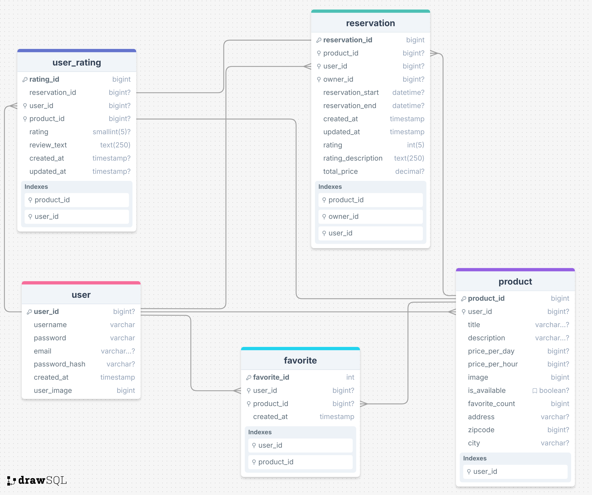

# Project Title

Recoup

## Overview

Peer-to-peer marketplace to rent essential home goods and hobby items from your neighbors.

### Problem Space

With the cost of our everyday lives always going up, everyone seems to be looking to have an extra income stream. At the same time, the ease of e-commerce and social media shopping has lead to phen

### User Profile

users:
- Hobbyist who has extra gear
- Renters looking to free up space in their apartment
- Urbanite who wants to get to know their neighbors or community
- Family who has a lot of stuff that their children don’t use anymore
 

Renters:
- Anyone looking to dip their toe into a new hobby instead of spending a lot on something they won’t continue
- Apartment dwellers who don’t have storage space to out-right purchase an item
- Somebody who doesnt have space or the budge to buy/own an item outright

### Features

- A user is able to create a profile by filling out some information about themsevles (a name and photo).
- A user is able to create a product page by filling out product information and uploading images.
- A user is able to reserve a product for either an hour or day.
- A user is able to search for all products
- A user is prompted to leave a rating of a product after their reservation has ended.

List the functionality that your app will include. These can be written as user stories or descriptions with related details. Do not describe _how_ these features are implemented, only _what_ needs to be implemented.

## Implementation

### Tech Stack

- GitHub
- MySQL
- Postman
Server Libraries:
    - Knex
    - Axios
    - Express
    - Node
Client Libraries:
    - React
    - Axios
    - React-router
    - React-router-dom
    - React-modal
    - SCSS

### APIs

I do not plan on using external data sources at this point for my capstone. I will be creating an API to house all user generated data.

### Sitemap

- Home page
- Login page
- Create a profile page
- User profile page
- Search for products page
- List a product as available page
- Product details page
- Leave a product rating page
- Modals to edit a product page and to edit a profile

View wireframe sitemap at https://octopus.do/yguqb7e7d3

### Mockups

Active Listing Page

Edit Product Details Page

Edit User Profile
.png)

List A Product Page & Flow

Product Details Page

Product Search Page

User Profile Page

User-Product Rating Page

### Data

### Endpoints

GET:
/user/:user_id = getting profile and user information about each user.

Parameters:

- username
- password
- token (optional)

Response:

[
    {
        "user_id": uuid,
        "username": "john smith",
        "password": "unique password",
        "email": johnsmith@gmail.com,
        "password_hash": "",
        "user_image": URL,
    },
]

GET:
/user/:user_id/reservation = user can see their past, current, and future product reservations and the information about the reservation and the product reserved (image, title, price)

Parameters:

- user id

Response:

[
    {
        "reservation_id": 1,
        "user_id": uuid,
        "user_id": uuid,
        "product_id": 1,
        "reservation_start": "",
        "reservation_end": "",
        "rating": 5,
        "rating_description": "it worked like a charm and John is super nice.",
        "total_price": "50"
    },
]

GET:
/user/:user_id/product = user’s list of all products available

Parameters:
- user id

Response:
[
    {
        "user_id": uuid,
        "product_id": 1,
        "title": "string",
        "description": "string",
        "price_per_day": "50",
        "price_per_hour": "15",
        "image": [{ "image": url }]
    }
]

GET:
/product = list of all products

Parameters:
- none

Response:
[
    {
        "product_id": 1,
        "price_per_day": "50",
        "price_per_hour": "15",
        "image": URL,
        "is_available": true
    }
]

GET:

/product/:product_id = a user can view a single product on an individual page

Parameter:
- product_id

Response:
[
    {
        "product_id": 1,
        "user_id": uuid,
        "title": "string",
        "description": "string",
        "price_per_day": "50",
        "price_per_hour": "15",
        "image": [{ "image": url }],
        "is_available": "true",
        "product_address": "string",
        "product_zipcode": "12345",
        "product_city": "string"
    }
]

GET:
/product/:product_id/user_rating = all ratings for a single product

Parameters:
- product_id

Response:
[
    {
        "rating_id": 1,
        "reservation_id": 1,
        "product_id": 1,
        "rating": "5",
        "review_text": "string"
    }
]

POST:
/user = making a new user profile

Parameters:
- username, the user's name
- image, a photo of the user
- password, upon account creation

Response:

[
    {
        "user_id": uuid,
        "username": "john smith",
        "password": "more unique password",
        "email": "johnsmith@hotmail.com
    }
]

POST:
/product = user list a new available product

Parameters:
- product_id
- user_id

Response:
[
    {
        "product_id": 1,
        "user_id": uuid,
        "title": "string"
        "description": "string",
        "price_per_day": "50",
        "price_per_hour": "15",
        "image": [{ "image": url }],
        "product_address": "string",
        "product_zipcode": "12345",
        "product_city": "string"
    }
]

POST:
/user_rating = user can leave a rating on a single product

Parameters:
- user_id
- product_id
- reservation_id

Response:
[
    {
        "reservation_id": 1,
        "user_id": uuid,
        "product_id": 1,
        "rating": "5",
        "review_text": "string"
    }
]

POST:
/reservation = user can rent an item

Parameters:
- product_id
- renter_id
- owner_id
- reservation_start
- reservation_end

Response:
[
    {
        "product_id": 1,
        "renter_id": uuid,
        "owner_id": uuid,
        "total_price": "50"
    }
]

PUT:
/product/:product_id = user can update the information for the products listed

Parameters:
- product_id
- user_id

Response:
[
    {
        "product_id": 1,
        "user_id": uuid,
        "title": "string"
        "description": "string",
        "price_per_day": "50",
        "price_per_hour": "15",
        "image": [{ "image": url }],
        "product_address": "string",
        "product_zipcode": "12345",
        "product_city": "string"
    }
]

PUT:
/user/:user_id = user can edit their profile information

Parameters:
- user_id

Response:
[
    {
        "username": "john doe",
        "password": "unknown password",
        "email": "johndoe@gmail.com:,
    }
]

PUT:
/reservation/:reservation_id = a user can edit a rating they left for a product

Parameters:
- product_id
- renter_id
- owner_id
- total_price

Response:
[
    {
        "product_id": 1,
        "renter_id": uuid,
        "owner_id": uuid,
        "reservation_start": datetime,
        "reservation_end": datetime,
        "created_at": datetime,
        "updated_at": datetime,
        "total_price": "50"
    }
]

DELETE:
/user/:user_id = user can delete their profile

Parameters:
- user_id

Response:
[
    {}
]

DELETE:
/reservation/:reservation_id = user can cancel a reservation

Parameters:
- reservation_id
- renter_id || owner_id

Response:
[
    {}
]

DELETE:
/product/:product_id = user can delete a product listing

Parameters:
- user_id
- product_id

Response:
[
    {}
]

DELTE:
/user_rating/:rating_id = user can delete a product rating

Parameters:
- rating_id
- user_id

Response:
[
    {}
]

## Roadmap

JIRA BOARD:
https://nickpaparo.atlassian.net/jira/software/projects/CAP/boards/1

---

## Future Implementations
The ability for a user to favorite a product and the list of favorites display on the user profile page in a carousel.

The ability for users schedule reservations in the future.

The ability for users to edit the reviews they have left on a product or rental.

V3: User-to-user messaging

